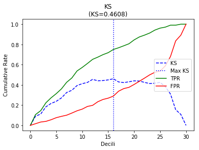
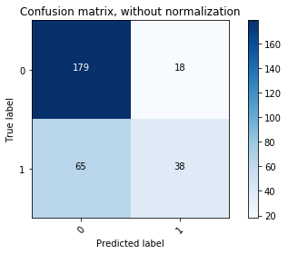

```python
import pandas as pd
import numpy as np
import scoring as sc

from sklearn.model_selection import train_test_split as tts
from sklearn.linear_model import LogisticRegression as lr
import sklearn.metrics as metrics
```


```python
df=pd.read_csv('gc.csv')
vardict=pd.read_csv('dict.csv')
df['Risk']=df['Risk'].apply(lambda x: 1 if x=='bad' else 0)
df=sc.renameCols(df,vardict,False)
label,disc,cont=sc.getVarTypes(vardict)
# sc.discSummary(df)

# ### No row needs to be removed from this example in this stage ###
# vardict.loc[vardict['new'].isin(['Age','Sex']),'isDel']=1
# df,vardict=cl.delFromVardict(df,vardict)
```


```python
df1=sc.binData(df,vardict)
```

    #########################################
    ####It's using Chi-Merge algorithm...####
    #########################################
    
    Doing continous feature: Age
    
    Doing continous feature: Credit amount
    Equal Depth Binning is required, number of bins is: 100
    
    Doing continous feature: Duration
    
    Doing discrete feature: Sex
    
    Doing discrete feature: Job
    
    Doing discrete feature: Housing
    
    Doing discrete feature: Saving accounts
    
    Doing discrete feature: Checking account
    
    Doing discrete feature: Purpose
    
    Finished
    


```python
bidict=sc.getBiDict(df1,label)
```


```python
bidict['Credit amount']
```


<div>
<style scoped>
    .dataframe tbody tr th:only-of-type {
        vertical-align: middle;
    }

    .dataframe tbody tr th {
        vertical-align: top;
    }

    .dataframe thead th {
        text-align: right;
    }
</style>
<table border="1" class="dataframe">
  <thead>
    <tr style="text-align: right;">
      <th></th>
      <th>Credit amount</th>
      <th>total</th>
      <th>good</th>
      <th>bad</th>
      <th>totalDist</th>
      <th>goodDist</th>
      <th>badDist</th>
      <th>goodRate</th>
      <th>badRate</th>
      <th>woe</th>
      <th>iv</th>
    </tr>
  </thead>
  <tbody>
    <tr>
      <th>0</th>
      <td>(-inf, 1282.0]</td>
      <td>211</td>
      <td>144</td>
      <td>67</td>
      <td>0.211</td>
      <td>0.223</td>
      <td>0.206</td>
      <td>0.682</td>
      <td>0.318</td>
      <td>-0.082</td>
      <td>0.001</td>
    </tr>
    <tr>
      <th>1</th>
      <td>(1282.0, 3446.32]</td>
      <td>469</td>
      <td>352</td>
      <td>117</td>
      <td>0.469</td>
      <td>0.390</td>
      <td>0.503</td>
      <td>0.751</td>
      <td>0.249</td>
      <td>0.254</td>
      <td>0.029</td>
    </tr>
    <tr>
      <th>2</th>
      <td>(3446.32, 3913.26]</td>
      <td>60</td>
      <td>55</td>
      <td>5</td>
      <td>0.060</td>
      <td>0.017</td>
      <td>0.079</td>
      <td>0.917</td>
      <td>0.083</td>
      <td>1.551</td>
      <td>0.096</td>
    </tr>
    <tr>
      <th>3</th>
      <td>(3913.26, inf]</td>
      <td>260</td>
      <td>149</td>
      <td>111</td>
      <td>0.260</td>
      <td>0.370</td>
      <td>0.213</td>
      <td>0.573</td>
      <td>0.427</td>
      <td>-0.553</td>
      <td>0.087</td>
    </tr>
  </tbody>
</table>
</div>


```python
# modified credit amount
sc.bivariate(pd.DataFrame({'y':df['y'],
                           'Credit amount':sc.manuallyBin(df,
                                                          'Credit amount',
                                                          'cont',
                                                          [-np.inf,1300,3500,4000,np.inf])}
                         ),'Credit amount','y')[0]
df1['Credit amount']=sc.manuallyBin(df,'Credit amount','cont',[-np.inf,1300,3500,4000,np.inf])
```


```python
bidict=sc.getBiDict(df1,label)
ivtable=sc.ivTable(bidict)
```


```python
df1,vardict,bidict=sc.featureFilter(df1,vardict,bidict,ivtable)
```


```python
df=sc.mapWOE(df1,bidict,label)
```


```python
### Modelling ###
#################
trainx,testx,trainy,testy=tts(df.iloc[:,1:],df[label],test_size=0.3)
m=lr(penalty='l1', C=0.9, solver='saga', n_jobs=-1)
m.fit(trainx,trainy)
pred=m.predict(testx)
pred_prob=m.predict_proba(testx)[:,1]

# 查看测试结果
cm=metrics.confusion_matrix(testy, pred)
print('**Precision is:',(cm[0][0]+cm[1][1])/(sum(cm[0])+sum(cm[1])))
print('\n**Confusion matrix is:\n',cm)
print('\n**Classification report is:\n',metrics.classification_report(testy, pred))
```

    **Precision is: 0.7233333333333334
    
    **Confusion matrix is:
     [[179  18]
     [ 65  38]]
    
    **Classification report is:
                   precision    recall  f1-score   support
    
               0       0.73      0.91      0.81       197
               1       0.68      0.37      0.48       103
    
       micro avg       0.72      0.72      0.72       300
       macro avg       0.71      0.64      0.64       300
    weighted avg       0.71      0.72      0.70       300
    
    


```python
### Evaluation ###
##################
sc.plotROC(testy,pred_prob)
sc.plotKS(testy,pred_prob)
sc.plotCM(metrics.confusion_matrix(testy,pred), classes=df[label].unique(),
          title='Confusion matrix, without normalization')
```





    Confusion matrix, without normalization
    [[179  18]
     [ 65  38]]
    





```python
### Scoring ###
###############
scored,basescore=sc.scoring(trainx.reset_index(drop=True),
                            trainy.reset_index(drop=True),
                            'y',
                            m,
                            bidict)
```
